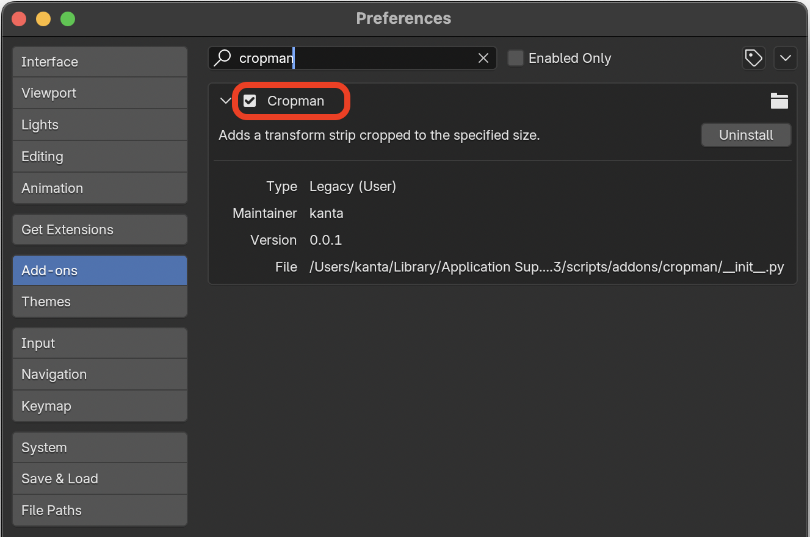

# Cropman

Blender VSEで対象ストリップを、指定したサイズでクロップするためのアドオンです。

## install

1. Blenderのアドオンディレクトリにプロジェクトをクローンする。

   - macOSの場合

   ```shell
   cd ~/Library/Application Support/Blender/<blender_version>/scripts/addons
   git clone https://github.com/kantas-spike/cropman.git
   ```

2. Blenderを起動し、`Preferences`-`Add-ons`から`Cropman`をチェックして有効にします。

   

## 使い方

本アドオンをインストール後、Blenderの **Video Editiong** を開くと、シーケンサー領域のサイドバーに**Cropman** タブが表示されます。
**Cropman** タブを選択すると、操作パネルが表示されます。

### 操作方法

1. **Cropman**パネルの`target strip`ドロップダウンで切り抜きたいストリップの名前を選択します。
2. `Add a placeholder`ボタンをクリックし、切り抜き範囲をあらわす半透明のカラーストリップ(プレイスホルダー)を追加します。[^1]
   1. 切り抜きたい範囲になるように、プレイスホルダーのサイズや位置を調整します。
3. `Crop all placeholders`ボタンをクリックし、追加した全てのプレイスホルダーを **Crop**設定された **Transformストリップ** に置き換えます。

[^1]: 複数のプレイスホルダーを追加することもできます。
